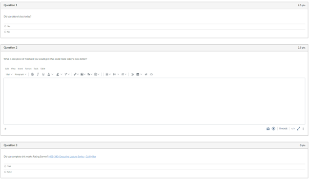
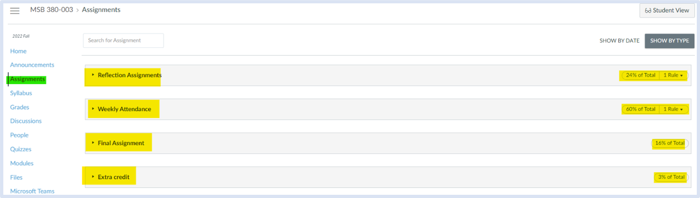
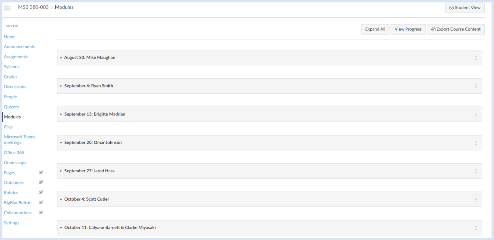

# CREATING ASSIGNMENTS, SECTIONS, MODULES, EXTRA CREDIT IN CANVAS

Once given access to Canvas, you set up the assignments structure for class. There will be two main types of assignments throughout the semester: reflection assignments and attendance quizzes. Additionally, there will also be a final assignment and extra credit assignments. 

### Creating Assignments

Given the nature of this class, the speakers will be announced as the semester progresses—usually one speaker at a time. At the beginning of the semester, all the assignments will be created. 

Refection assignments will be named: “Reflection Assignment: <\<date>>”. 

Attendance quizzes will be called: “Attendance Quiz: <\<date>>”.  The final assignment will be called: “Final Assignment”.

 The extra credit assignments will be called: “Latter-day Saint MBA Podcast: Brigitte Madrian”, “Latter-day Saint MBA Podcast: Mike Maughan”, and “Latter-day Saint MBA Podcast: Ryan Smith” (Extra-credit assignment are subject to change, this is to be determined with Dean Madrian and Mike Maughan).

### Attendance Quizzes

Attendance quizzes will be due the midnight of each class (if classes are on Wednesdays, the attendance quizzes will be due by 11:59pm on that Wednesday). They are usually opened right after class ends (this set as you are creating the assignment, you don’t need to manually open it once class ends). For instructions on how to set open and due dates for assignments in Canvas click here. 

Attendance quizzes will have three questions:

-	Did you attend class today? (yes/no)
-	What is one piece of feedback you would give that could make today’s class better? (open-ended, text entry)
-	Did you complete this week’s Rating Survey? <\<link to Qualtrics survey>> (yes/no) *
All quizzes will be worth 5 points and questions 1-2 will be worth 2.5 points each. Question 3 will not be assigned any points *More on the Rating Survey Below

### Reflection Assignments

Reflection Assignments will be due the midnight of the Friday following each class (if classes are on Wednesdays, the reflection assignments will be due by 11:59pm on the following Friday). They usually are opened right after class ends. For instructions on how to set open and due dates for assignments in Canvas click here. 

Reflection Assignments will have one open-ended question that reads the following: “Submit a two-paragraph reflection in response to the following questions. What is something meaningful you learned from this week’s speaker? Why was it personally meaningful to you?”

All assignments will be worth 2 points.

### Extra Credit

Extra credit assignments will be dur the last day of classes by midnight. They will have one open-ended question that reads the following: “Listed to the podcast and answer the following questions:

1. "What is one personal takeaway that you found meaningful and memorable? Why?" (1 paragraph)
2. "What is one question you wish the interviewer would have asked? Why? (1 paragraph) <\<link to podcast>>”

Extra credit assignments will be worth 1 point. The links to the podcasts that were used last semester are here:

https://open.spotify.com/episode/1j8MJKSw8kxOFUa92Z4BAU?si=61dcda5e76f64650&nd=1

https://open.spotify.com/episode/4CxmP04ZsIIWhMEakLhQ5e?si=b260f29f14904c8c&nd=1

https://open.spotify.com/episode/12U9mHQ59rjBEbiMXMEcGR?si=19a3c7b9eb394474&nd=1

### Final Assignment

The Final Assignment will be due the last day of final exams of the semester by midnight. The instructions for the final assignment will read the following: “Write a letter to your future-self sharing what advice/principles you learned and hope your future self remembers and applies from the class. At least one page, double-spaced. Please submit as a .pdf document.”

The final assignment will be worth 16 points.

For instructions on how to restrict file types for assignments click here. 

### Assignment Groups

When creating assignments in the Assignments section of class, you will be able to create both assignments and assignment groups. To be able to assign grading weights, you need to create a group for each type of assignment (reflection, attendance, final, extra credit). For instructions on how to create assignment groups and give groups different weights, click here.

### Modules

Once Assignment groups have been created, all the assignments need to be organized or grouped according to their due dates or the class they belong to. The name of each module will be: “<\<Date>>: <\<Guest Speaker>>”. Since the names of the guest speakers will most likely be announced on a weekly basis, all the modules will have “TBD” in lieu of the name until it is announced who will come. There will also be a module for extra credit and it will be called “Extra Credit”. For instructions on how to create modules, click here.

### Assigning weights to assignment groups

Not all the types of assignments will be weighted the same. The weighting breakdown is as follows:

Reflection Assignments	24% 
Attendance Quizzes		60% 
Final Assignment		16% 
Extra Credit			3%

For instructions on how to create assignment weights click here.

***Note, the total weight breakdown totals 103%. This is because of the optional extra credit assignments. It will be worthwhile to mention to the students in class as the semester is ending that if they see that their grades are not accurate because of the extra credit, tell them that once all assignments are graded their correct score will be shown. 

### Dropping 2 lowest scores

Previously, the syllabus mentioned that two attendance quizzes and two reflection assignments would be dropped at the end of the semester to allow for 2 absences for each student during the semester. For instructions for how to add rules to drop the 2 lowest scores, click here. 